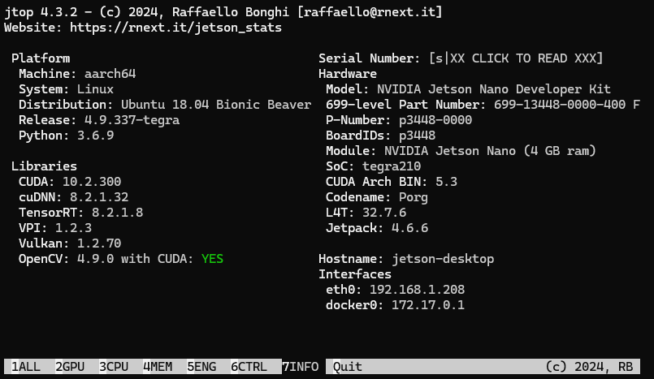

# OCR implementation on Jetson Nano
> This repository contains the source code and tutorial of the OCR models that are going to be used and benchmarked in Jetson Nano.


> :warning: **It is recommended to, at least, use a 32GB SD card for installing Jetson Nano's OS.** Personally, if it is possible I recommend you to use a 64GB SD card. This way you will be able to download and test several models as well as increasing the SWAP memory, which will be mandatory for many acceleration techniques and library installations.  

## 0. Repository structure
```
ocr-in-jetson-nano/
├── benchmarks/
├── docs/
├── easy_ocr/
├── dossier_related_documents/
├── gpu_inference_RTX3090/
├── logs/
├── paddle_ocr/
├── process_logs.ipynb
```

- ``docs/``: README file images.
- ``benchmarks/``: Contains scripts for benchmarking OCR model performance.
- ``easy_ocr/``: Code and configuration specific to the EasyOCR model.
- ``paddle_ocr/``: Code and configuration specific to the PaddleOCR model.
- ``gpu_inference_RTX3090/``: Scripts for OCR inference on an NVIDIA RTX 3090 GPU.
- ``process_logs.ipynb``: Jupyter notebook for processing and analyzing log files.
- ``logs/``: Stores log files from experiments, training, and inference runs (empty).
- ``follow_up_documents/``: Documents regarding follow-up and reports for TFG assignments.


## 1. JetPack installation
The first task to do is installing the JetPack SDK for Jetson Nano. To do so, follow [NVIDIA's "Getting Started" official site](https://developer.nvidia.com/embedded/learn/get-started-jetson-nano-devkit). Latest availbale version at this repository publication is JetPack 4.6.6. Once you have installed the OS, make sure that you can connect to the Jetson Nano and it is functional.

:information_source: You have two different options for using the Jetson:

1. Connect the Jetson Nano to a screen with HDMI or Display Port and connect a mouse and keyboard to use it as a fully disposable computer. _This is not recommended since the interface is quite laggy and at full load you may have issues displaying any image. Moreover, the screen display may consume some resources._

2. **Recommended:** connect via SSH to your Jetson Nano. To do so, you have to connect your computer to the same network as the Jetson Nano. Then, open a terminal in Jetson and run `hostname -I`. Copy the first IP and open your Host device terminal. Run `ssh <jetson_user>@<copied_ip>`. Type the password that you have set to your Jetson Nano. Now you will be able to work remotely with your Jetson Nano.

:warning: To ensure maximum performance in Jetson Nano, run the following commands:
```bash
# Increase CPU and GPU clock speed
sudo jetson_clocks
# Activate 10W mode in Jetson Nano
sudo nvpmodel -m 0
```

## 2. Mandatory packages installs
JetPack 4.6.6. comes with some pre-installed core libraries such as cuDNN, CUDA and TensorRT. However, many other dependencies will have to be manually installed. This is a list of the most relevant ones.

> :information_source: Before installing any library run: 
```bash
sudo apt-get update
sudo apt-get upgrade
```
> This will update all apt packages, letting you install the latest available versions of most needed packages.

### 2.1. Python 3.6.9. configuration
The following commands will setup the basic Python configuration. These dependencies will allow the installation of many packages.
```bash
sudo apt install python3-pip
sudo apt install libopenblas-dev libopenmpi-dev virtualenv libopenblas-base libomp-dev libjpeg-dev zlib1g-dev libpython3-dev  libavcodec-dev libavformat-dev libswscale-dev
pip3 install -U pip setuptools
pip3 install -U numpy
pip3 install 'Cython<3'
```
If everything has been correctly installed, by doing `python3`, a Python terminal should be executed.

#### 2.1.1. PyTorch install

Notice that PyTorch's latest available version that supports CUDA 10.2 (which is our JetPack CUDA version) in Python 3.6.9. Is PyTorch 1.8.0. To install it we will need to manually download its wheels.
```bash
wget https://nvidia.box.com/shared/static/p57jwntv436lfrd78inwl7iml6p13fzh.whl -O torch-1.8.0-cp36-cp36m-linux_aarch64.whl
pip3 install numpy torch-1.8.0-cp36-cp36m-linux_aarch64.whl
```

#### 2.1.2. Torchvision install
Torchvision is a useful package for data transformation and deep learning functionalities. Follow these steps to download it.
```bash
git clone --branch v0.9.0 https://github.com/pytorch/vision torchvision
cd torchvision
export BUILD_VERSION=0.9.0
python3 setup.py install --user
cd ../
pip install 'pillow<7'
```

PyTorch and Torchvision should be properly running with CUDA support. To check that, run the following commands:
```bash
python3
import torch
print(torch.cuda.is_available())

import torchvision
print(torchvision.__version__)
```
Output should be **True** and torchvisions version 0.9.0.

#### 2.1.3. OpenCV installation
OpenCV is the core library for many image transformation and image handling in Python. It can be installed with CUDA support which could help accelerating some tasks. To install it, follow this tutorial from [make2explore/Tutorial-OpenCV-on-JetsonNano-with-CUDA-support](https://github.com/make2explore/Tutorial-OpenCV-on-JetsonNano-with-CUDA-support/tree/main). The tutorial recommends you to revert the SWAP memory increase. 
:Warning: If you have enough disk storage and are planning to create TensorRT engines with low quantization values, I recommend keeping the SWAP memory modification.

#### 2.1.4. Torch2Trt
Torch2trt is a package that simplifies TensorRT engine optimization to PyTorch existing code. To install it, follow its tutorial from the official GitHub repository [NVIDIA-AI-IOT/torch2trt](https://github.com/NVIDIA-AI-IOT/torch2trt).

### 2.2. Other core packages that will be needed.
1. Install **jtop**. This package will allow you to display in real time how are the Jetson Nano resources being used. There is an information window that will give you information about installed packages and other OS relevant data. Install with `sudo -H pip3 install -U jetson-stats`.




2. Install **NANO** with `sudo apt-get install nano`. This is a package that will allow you to edit textfiles in terminal. While this is enough for small edits, I recommend you developing code in an IDE like Visual Studio Code, for example, and then move your files with `scp` command.
```bash
scp -r <origin_location> <target_location>
# remember that Jetson Nano's location will be defined by <jetson_user>@<jetson_ip>:<file_output_location>
```

## 3. EasyOCR installation
Installing EasyOCR isn't as straightforward as it may look like. You will need two installs.
```bash
pip3 install "opencv-python-headless<4.6"
pip3 install "easyocr==1.6.2"
```

This will install a deprecated version of EasyOCR. In fact, if you try to make some inference with the OCR motor the program will crash. To fix this we will have to modify a script inside the EasyOCR package source files.

Inside Python packages directory look for EasyOCR package and run the following command `nano <path_to_package>/easyocr.py`.

Inside the script, modify the import `from bidi import get_display` to `from bidi.algorithm import get_display`.

**Now EasyOCR is fully functional.**

## 4. PaddleOCR installation
PaddleOCR installation is simpler. Earliest functional version of PaddleOCR is only available for Python >=3.7.5. For this reason, you will have to install a new Python version. Using a different environment will avoid many compatibility problems.

In order to complete the installation, follow this tutorial from [SAhmad75/Jetson-Nano-PaddleOCR-Tutorial](https://github.com/SAhmad75/Jetson-Nano-PaddleOCR-Tutorial)

## :rocket: Complete installation!
Right now every package should be working properly and you could start running inference among many different PyTorch models. EasyOCR and PaddleOCR should be also available for inference.

You will find already executable scripts in the folders inside this repository.